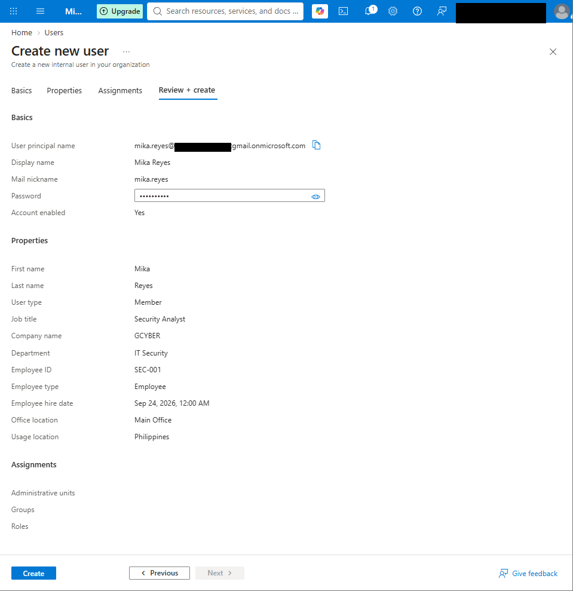
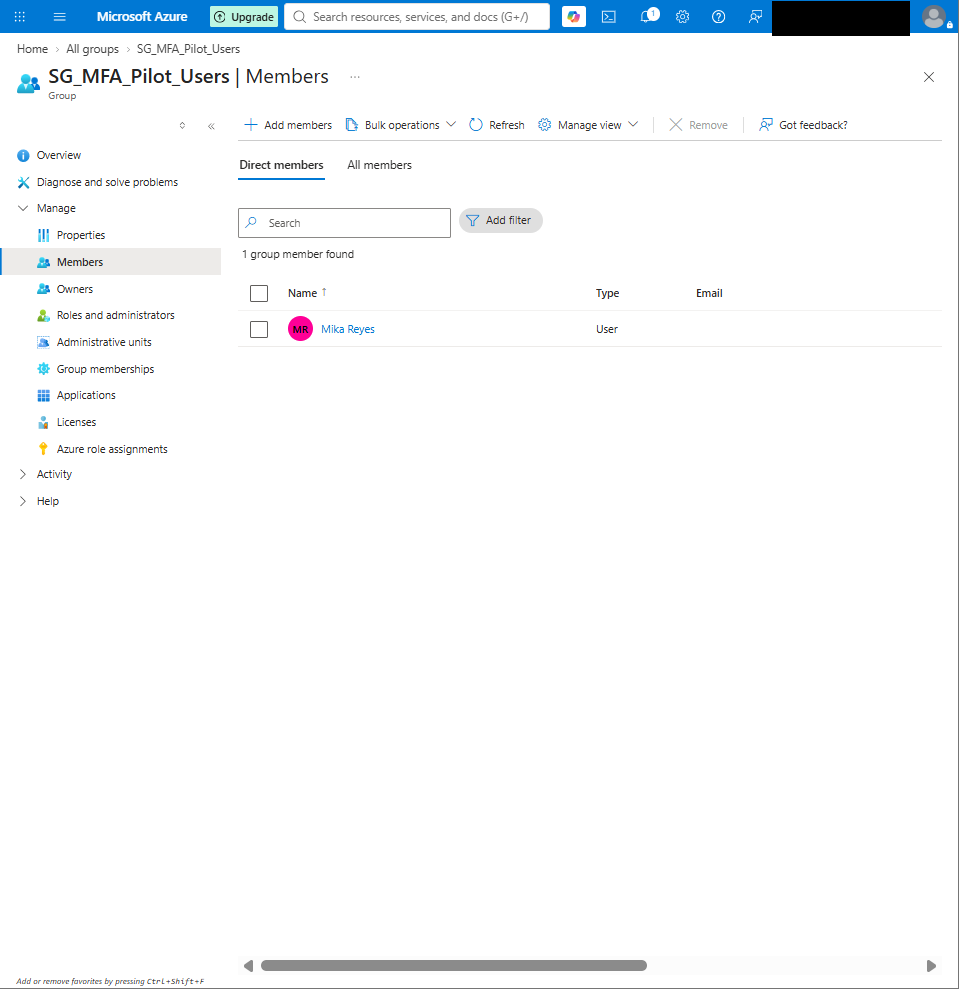
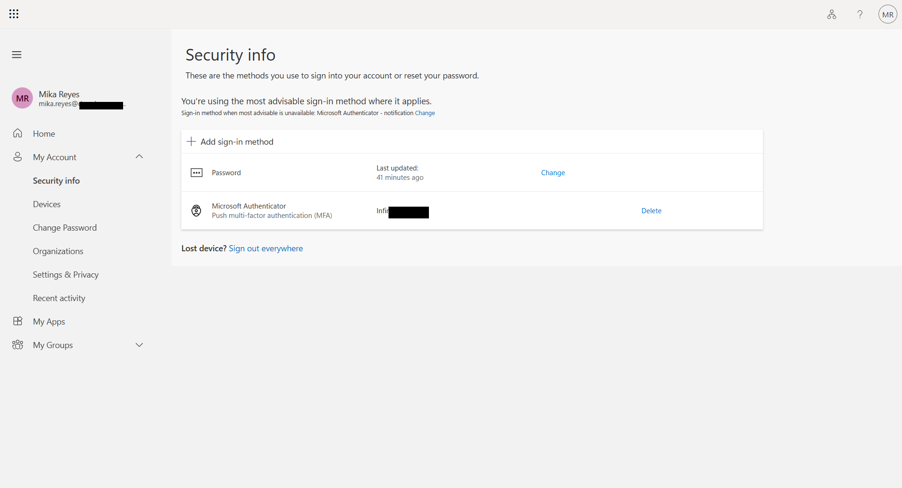
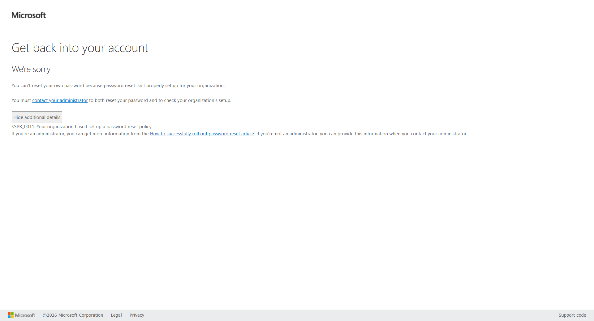
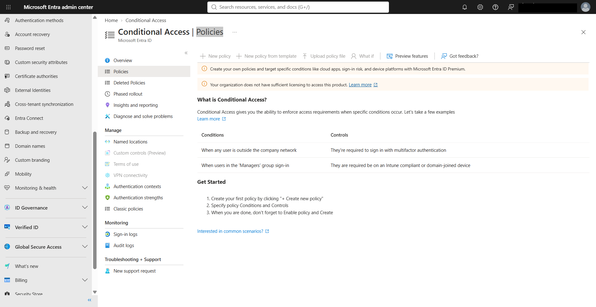
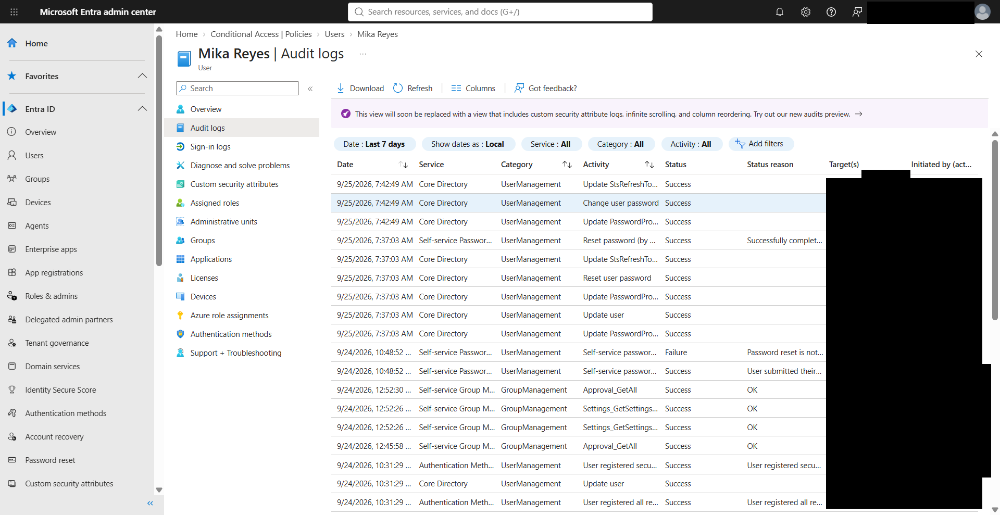

# Microsoft Entra Authentication & Access Policy Lab

Hands-on Microsoft Entra ID IAM lab focused on authentication methods, MFA registration, password recovery, access-policy troubleshooting, and audit-log verification.

> This project was completed in a personal lab environment using fictional test identities. It represents hands-on project experience, not production enterprise administration.

---

## Project Objectives

- Configure and review Microsoft Entra authentication methods
- Create a pilot user and security group for authentication testing
- Register Microsoft Authenticator for MFA
- Test Self-Service Password Reset (SSPR)
- Troubleshoot SSPR configuration and licensing limitations
- Review Conditional Access availability
- Perform an administrator-assisted password reset
- Validate password changes through Microsoft Entra audit logs

---

## Environment

**Platform:** Microsoft Entra ID  
**Tenant:** Personal lab tenant  
**License:** Microsoft Entra ID Free  
**Test identity:** Mika Reyes  
**Pilot group:** `SG_MFA_Pilot_Users`

---

## 1. MFA Test User Provisioning

Created a fictional employee identity named **Mika Reyes** with security-related user attributes including:

- Job title: Security Analyst
- Department: IT Security
- Company: GCYBER
- Employee ID: SEC-001
- Account status: Enabled

This provided a controlled identity for authentication and recovery testing.

---

## 2. MFA Pilot Group

Created the security group:

`SG_MFA_Pilot_Users`

Mika Reyes was added as a direct member.

The pilot-group approach demonstrates how authentication changes can be tested with a limited population before broader deployment.

---

## 3. Microsoft Authenticator Registration

Microsoft Authenticator was registered for Mika Reyes and verified under the user's Security Info page.

The registered method supported push-based multifactor authentication.

---

## 4. Self-Service Password Reset Troubleshooting

A user-side password recovery test was performed through the Microsoft SSPR portal.

The recovery attempt returned:

`SSPR_0011`

The portal reported that the organization had not configured a password reset policy for the user.

This demonstrated an important IAM troubleshooting workflow:

**User issue → reproduce problem → capture error → review policy → verify administrator permissions → review licensing**

Additional investigation confirmed:

- The administrator account had Global Administrator privileges
- Mika Reyes had no assigned product licenses
- The lab tenant used Microsoft Entra ID Free

The limitation was documented rather than representing SSPR as successfully deployed.

---

## 5. Conditional Access Licensing Review

The Conditional Access portal was reviewed to evaluate custom access-policy capabilities.

The tenant displayed:

**"Your organization does not have sufficient licensing to access this product."**

Policy creation controls were unavailable in the current lab environment.

This demonstrated the importance of validating tenant licensing before planning or deploying Conditional Access policies.

---

## 6. Administrator-Assisted Password Recovery

Because self-service password recovery was unavailable in the current lab configuration, an administrator-assisted password reset was performed.

Workflow:

**User recovery issue → Admin validation → Password reset → Temporary password → Forced password change → Verification**

Microsoft Entra generated a temporary password that required Mika to change the password during the next sign-in.

The temporary password and final user password were not captured in portfolio evidence.

---

## 7. Audit Log Verification

Microsoft Entra Audit Logs were reviewed after the recovery process.

The logs confirmed successful events including:

- **Reset password by administrator**
- **Change user password**

This provided auditable evidence that both the administrative recovery action and subsequent user password change were completed successfully.

---

## Key IAM Concepts Demonstrated

| Concept | Demonstration |
|---|---|
| Authentication | Tested Microsoft Entra user sign-in behavior |
| MFA | Registered Microsoft Authenticator |
| Security Groups | Used a dedicated MFA pilot group |
| Least Privilege | Test user received no administrative role |
| SSPR | Tested and troubleshot self-service password recovery |
| Conditional Access | Evaluated availability and licensing limitations |
| Password Recovery | Performed administrator-assisted reset |
| Auditability | Verified password actions through Audit Logs |
| Troubleshooting | Followed error → policy → permissions → licensing → verification |

---

## Security Principles Applied

**Least Privilege**  
The test identity was created without unnecessary administrative privileges.

**Pilot Deployment**  
A dedicated security group was used to represent controlled security-policy testing.

**Credential Protection**  
Temporary and permanent passwords were excluded from portfolio evidence.

**Verification**  
Administrative actions were validated using user-side testing and Microsoft Entra logs.

**Auditability**  
Password-reset and password-change events were confirmed through the audit trail.

---

## Key Takeaway

This lab demonstrated that IAM administration is not only about creating users or enabling authentication methods.

Effective identity operations also require:

**Configure → Test → Troubleshoot → Verify → Document**

The project provided hands-on experience with Microsoft Entra authentication, MFA registration, password recovery troubleshooting, licensing-aware decision making, administrator-assisted recovery, and audit-log validation.
